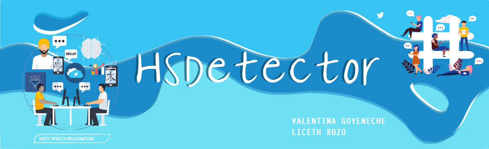

# Detección de Hatespeech en Twitter
<ul>
   <li> Valentina Goyeneche Calderón
   <li> Liceth Yaneth Rozo Quintana
</ul>

## Motivación

Debido a que las redes sociales son una gran influencia actualmente y que estas redes no tienen un proceso de filtrado eficaz en la información que permiten o no publicar a los usuarios, personas o grupos las utilizan como plataformas para difundir y generar odio en la sociedad, por lo que este proyecto pretende encontrar patrones en publicaciones de redes sociales sobre el discurso de odio(hate speech) con el fin de filtrarlo.

## Dataset

* Detección de hatespeech en Inglés 
   * Datos: 24.783 tweets clasificados como ofensivo, de odio, o ninguno. [(fuente)](https://data.world/thomasrdavidson/hate-speech-and-offensive-language)
              
* Detección de hatespeech en Español 
   * Colombia
      * Datos: 16.044 tweets.
   * Bucaramanga
      * Datos: 2.381 tweets.

## Video 
https://www.youtube.com/watch?v=S7qOzw1CTnw
